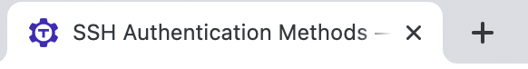
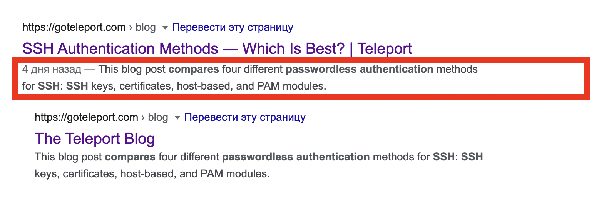
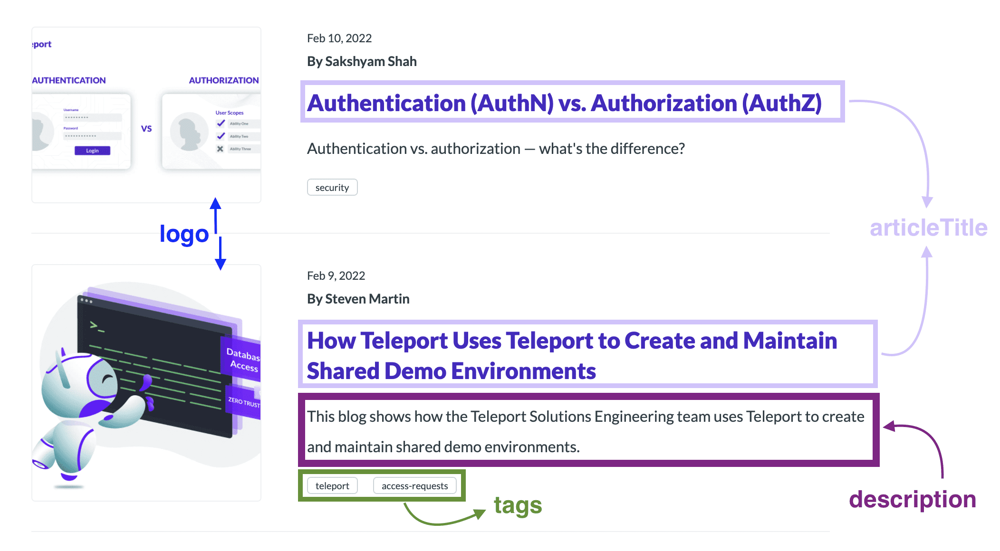
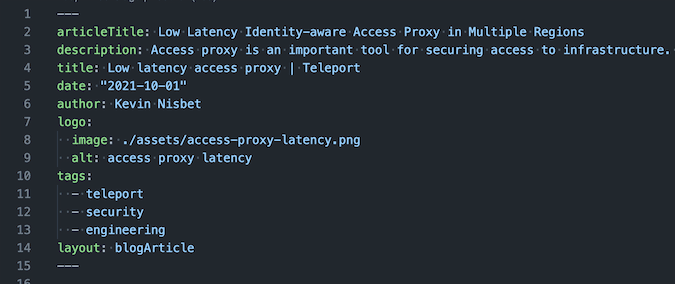
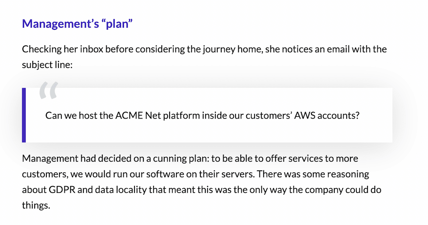

# blog

# Getting started

## Prerequisites

**Node.js 14+ is installed in the system.**

If you don't have Node.js installed, or its version is smaller than 14, follow
[this guide](https://nodejs.org/en/download/package-manager/) to install it.

**`yarn` is installed in the system as a package manager.**

Yarn in an alternative package manager for Node.js. It needs to be installed separately.
If you already have Node.js installed, run the following command to add Yarn:

```bash
npm install --global yarn
```

## Installation

Clone the repo and init submodules with the actual docs:

```bash
git clone git@github.com:gravitational/blog.git
cd blog
```

Install dependencies with:

```bash
yarn
```

## Running blog

Now run one of the following commands:

- `yarn dev` - will run development server for blog at `localhost:3000/blog` that will autorefresh pages in real time when you edit markdown documents.
- `yarn build` - will build static production version.
- `yarn start` - will display documentation built with `npm run build` at `localhost:3000`.

## Development-related commands

- `yarn test` – runs tests. Used on CI.
- `yarn lint` – checks JS and TS files for errors and automatically fixes them.
- `yarn lint-check` – checks JS and TS files for errors, but doesn't fix them. Checked in CI and on commit.
- `yarn typecheck` – validates TypeScript type-related errors. Used on CI.
- `yarn build-node` – builds configs and plugins for mdx.
- `yarn extract-article-covers` - copy the image for the last five articles of the main page and the tag pages of the blog into a shared folder. This script will automatically run with the `yarn build` or `yarn dev` commands. To see new post cover in `/blog` or `/blog/tags` root page during development you have to restart development server (`yarn dev`).
- `yarn generate-rss` – generates rss-feed for blog.
- `yarn generate-sitemap` - generates sitemap for blog.

## Creating a new article

1. Create a new folder in the `pages` folder. The name of this folder will be part of the uri address for this article _(slug)_. If you named the folder `ssh-config`, the address of this article will be `goteleport.com/blog/ssg-config/`.
2. If you have pictures in your article, then create a new folder inside the folder you created in the p.1 and name it `assets`. Put all the article related pictures inside of it..
3. For the article create file `index.mdx` in the folder (p.1).
4. At the very top of the article file `index.mdx` must be specified `frontmatter` - article meta-information. These fields are required for further work and displaying the new article in the blog.
5. On the first line of the file `index.mdx` type `---`. This will be the beginning of `frontmatter` section. Write the following lines below:
   - `title` is the name of the tab in the browser. Also `title` is displayed as the title in search results page while someone googling. If the title of the article (`articleTitle`) and the name of the tab are the same, you can specify only the title of the article.
     
   - `description` - this is a short and clear summary of the page content. It lets search engines and users know what content is waiting for them on the page. Often search engines use the `description` as a short description (snippet) - which is visible in the search results page. Among other things, `description` appears in the list of articles on the main page of the blog and on pages filtered by tag (here and below - the list of articles).
     
   - `articleTitle` is the title of the article on the article page. Also `articleTitle` is displayed as the title in the list of articles.
     
   - `date` - is specified in the format YYYYY-MM-DD. Subsequently, this format is transformed into the desired format for the article card in the list of articles and for the page of the article itself.
   - `author` - the author of the article.
   - `logo` - the structure below:
     ```
     logo:
      image: ./assets/passwordless@2x.png
      alt: Passwordless SSH
     ```
     Where `image` - a path to the image. Which will be displayed in the list of articles and under the title in the article.
   - `tags` - specify the tags, which can be associated with the article. According to these tags the user can filter articles in the blog. Tagging format: each tag is written on a new line and preceded by put a sign `-`.
     ```
     tags:
      - teleport
      - security
      - engineering
     ```
   - `layout: blogArticle` - this field is used to form a general list of articles.
6. After writing all the fields, type `---` again on the next line. This will indicate the last line of `frontmatter` section.
7. Here is an example of a complete fromtmatter
   
8. If you will have images in the article (other than the one you specified in `logo`), you will need to import a component for images. You may also need a quote or subscribe component. These imports are specified after `frontmatter`.

   - for an image `import BlogImage from "components/BlogImage";`
     further use in the article:
     ```
     <BlogImage
       src="./assets/architecture-for-aws-iam-multiple-accounts.png"
       alt="architecture for aws iam multiple accounts"
     />
     ```
     or if you need a picture with a caption
     ```
     <figure>
      <BlogImage alt="Cluster management screen" src="./assets/teleport-clusters-4.3.png"/>
      <figcaption>
        A new clusters management screen that allows users to search and manage clusters at scale. Previously this was a dropdown menu causing major UX issues
      </figcaption>
     </figure>
     ```
   - for a quote component `import Quote from "components/Quote";`
     further use in the article:
     ```
     <Quote>
      Can we host the ACME Net platform inside our customers’ AWS accounts?
     </Quote>
     ```
     it will renders like:
     
   - for a subscribe component `import { EmailSubscribeViolet } from "components/EmailSubscribe";`
     further use in the article:
     ```
      <EmailSubscribeViolet />
     ```
     it will renders like:
     

9. To learn more about basic `.md`/`.mdx` syntax read these nice articles:

- [Basic Syntax | Markdown Guide](https://www.markdownguide.org/basic-syntax/)
- [Basic writing and formatting syntax GitHub](https://docs.github.com/en/get-started/writing-on-github/getting-started-with-writing-and-formatting-on-github/basic-writing-and-formatting-syntax)
